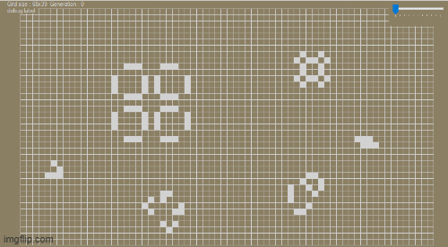

# GameOfLife
Yet another implementation of Conway's Game of Life - C# with Winforms flavour... yummy.

This attempts to follow the original game rules, but falls short with finite bounds, as the 2D array that stores the cells is a fixed size that is designed to fit within the window.  

So far, I've been happy with my game state saving and loading, as well as the start soup exporting, which required some extra property management, and WinForms dialog boxes,
the dynamic resizing of the game grid to fit the window,
and some graphics optimisation achieved by restricting per-update redrawing to cells that had changed state (rather than the entire grid).

Issues I encountered included:
- WinForms not being able to use the Drawing facilities in the form's load event
	- my solution was to use the first trigger of the game ticker's tick event to draw the initial grid
- WinForms is - unsurprisingly - not optmised for graphics performance, which led to the visibility of scan lines as the screen was updated
	- my solution is outlined in the paragraph above
- Programmatically resizing the window doesn't trggier the form's resizing events, so the speed slider can disappear off-screen when loading a state file
	- a potential solution would be to call the procedure for repositioning the slider after the loading is done and the window has been resized

A slightly outdated demo video (including upscaled window projection, sorry) is [here](demos/earlyDemo.mp4).

