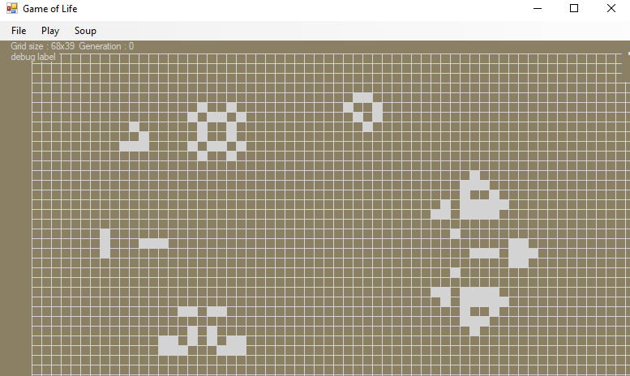

# GameOfLife
Yet another implementation of Conway's Game of Life - C# with Winforms flavour... yummy.

This attempts to follow the original game rules, but falls short with finite bounds, as the 2D array that stores the cells is a fixed size that is designed to fit within the window.  

  

Features that I am pretty happy with:
- game state loading and saving, and start soup exporting
- dynamic resizing of the game grid to fit the window
- the graphics optimisation mentioned in the notes section below

Some other notes:
- winforms doesn't allow Drawing in the form's load event, so my solution was to use the game timer's first tick to draw the initial grid
- winforms is not optimised for graphics performance (who would have guessed, huh?), so to reduce visibility of scan lines while recolouring cells, I kept a collection of coordinates of cells that had changed state
- I tried to implement customisable background and foreground colours but it wouldn't let me redraw the grid after changing the colour, and the default ColorDialog doesn't seem to have a way of chaging the default colour (for when the user closes the picker without selecting one) and I was not a fan of the default black
- programmatically resizing the window doesn't trigger the form's resize end event, so the speed timer sometimes disappears off-screen when loading a same with a different window size

A slightly outdated demo video (including upscaled window projection, sorry) is [here](demos/earlyDemo.mp4).
